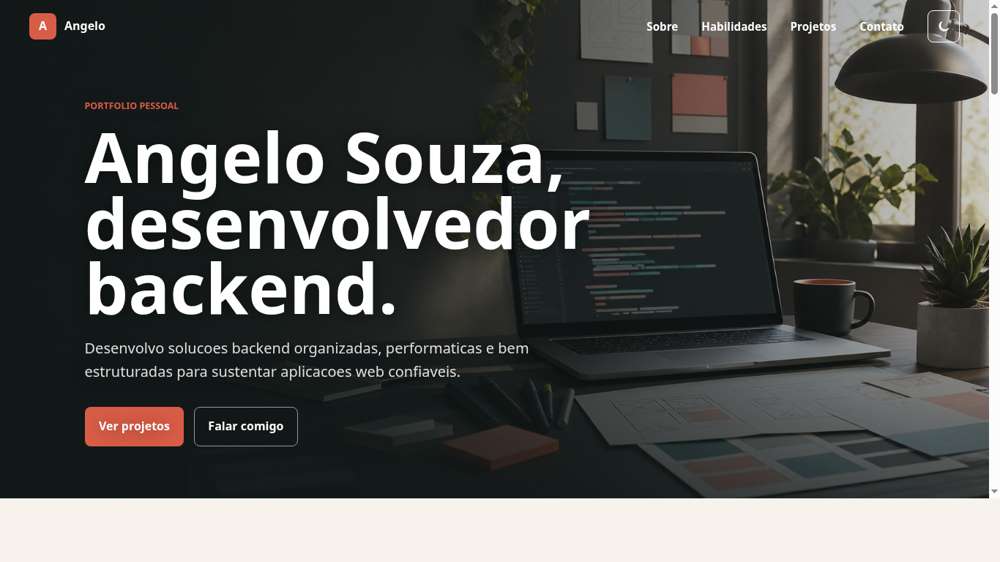
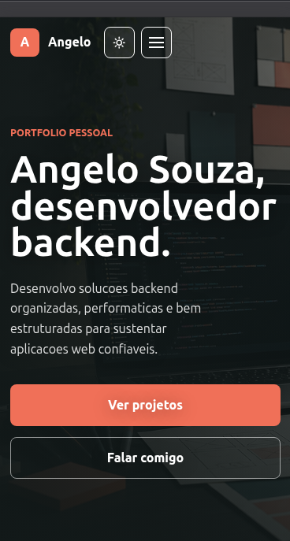
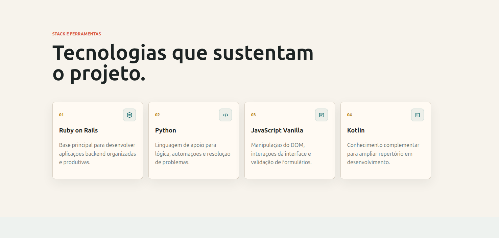
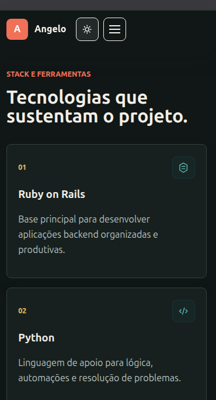
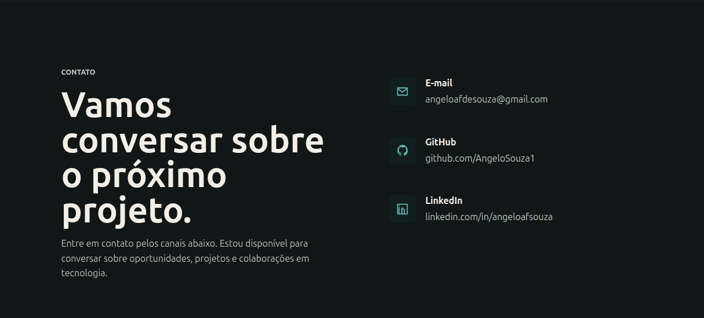
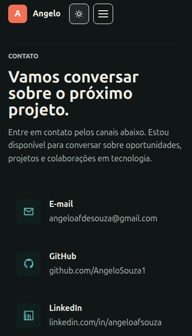

# Portfólio Pessoal - Angelo Souza

Portfólio pessoal estático de Angelo Souza, desenvolvedor backend e graduando
em Análise e Desenvolvimento de Sistemas.
O projeto atende ao desafio proposto no escopo T7G22: protótipo no Figma,
HTML semântico, CSS moderno, JavaScript vanilla, responsividade, animações
nativas, documentação e deploy público.

## Status

Concluído.

## Deploy

[Portfólio Alpha no GitHub Pages](https://angelosouza1.github.io/Portfolio-Alpha/)

## Protótipo Figma

[Portfólio Angelo Souza T7G22](https://www.figma.com/design/LKi1Q4s2SkE2mPfnmsjHV6/Portfolio-Angelo-Souza---T7G22?node-id=22-129&t=bQvbzkiuTSGFZYKA-1)

## Tecnologias

- HTML5 semântico
- CSS3 com Custom Properties, Flexbox, Grid, media queries e keyframes
- JavaScript vanilla para menu mobile, modo escuro, scroll e animações de entrada
- GitHub Pages ou Vercel para deploy

## Como rodar localmente

Abra o arquivo `index.html` no navegador ou use um servidor estático simples:

```bash
python3 -m http.server 3000
```

Depois acesse `http://localhost:3000`.

## Estrutura

```text
.
├── assets/
│   ├── css/
│   │   └── styles.css
│   ├── images/
│   │   ├── projects/
│   │   │   ├── amigo-secreto.svg
│   │   │   ├── pagamento-gateway.svg
│   │   │   └── send-ticket.svg
│   │   ├── hero-workspace.png
│   │   └── perfil.jpg
│   └── js/
│       └── script.js
├── docs/
│   ├── explicacao-codigo.md
│   └── figma-checklist.md
├── index.html
└── README.md
```

## Documentação de estudo

- `docs/figma-checklist.md`: roteiro para cumprir a etapa de UI/UX no Figma.
- `docs/explicacao-codigo.md`: explicação didática do `index.html`, `assets/css/styles.css` e `assets/js/script.js`.

## Checklist do escopo

- [x] HTML5 semântico
- [x] CSS Variables
- [x] Layout com Flexbox e Grid
- [x] Responsividade mobile, tablet e desktop
- [x] Animações e microinterações nativas
- [x] Modo escuro com CSS Variables
- [x] JavaScript vanilla modular
- [x] README inicial
- [x] Link do Figma
- [x] Prints ou GIF demonstrativo
- [x] Links reais dos projetos
- [x] Deploy ativo

## Prints

### Home - Desktop



### Home - Mobile



### Habilidades - Desktop



### Habilidades - Mobile



### Contato - Desktop



### Contato - Mobile



## Observações

Projeto finalizado conforme os requisitos do escopo.
